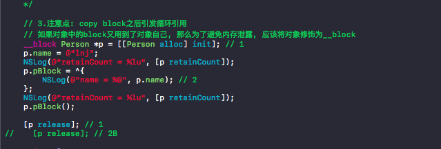
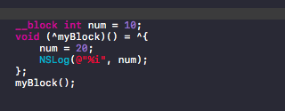

# block中copy和block加载

block在栈中,block使用的对象是深拷贝,在堆中则是浅拷贝
***

对属性进行copy修饰,可以防止外界修改内部数据
***

实际上在这里,block在还没有调用之前已经加载到代码区了,所以block如果是copy(被转移到堆区)的,就已经对d进行了一次新的引用,计数器为2

如果block不是copy(默认栈区)的,那么block加载到代码区即完成了copy一个新对象的过程,两个1也是2
***

如果block用到了对象自己(p.name),那么用__block修饰(浅拷贝))可以让编译器不会对对象进行一次retain( 跟下图一样) 对num进行__block修饰,则进行得是浅拷贝,对原有对象计数器+1,不会产生新的对象

